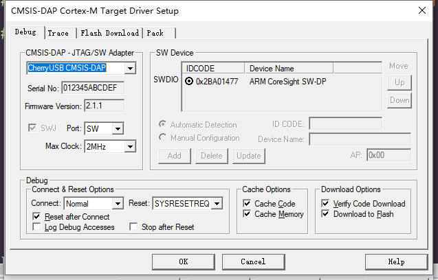
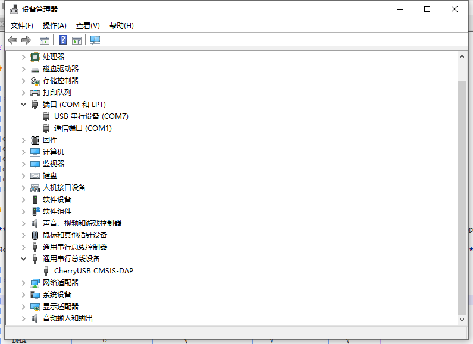
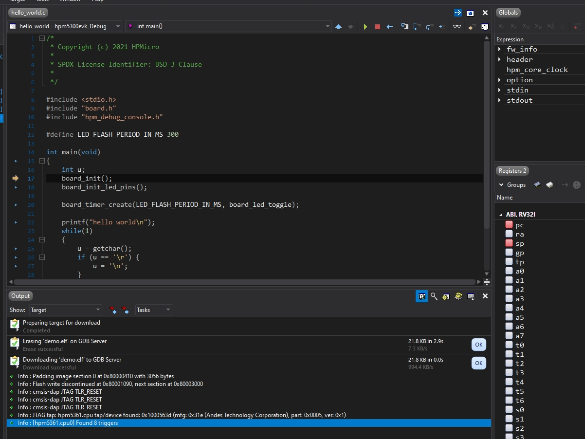
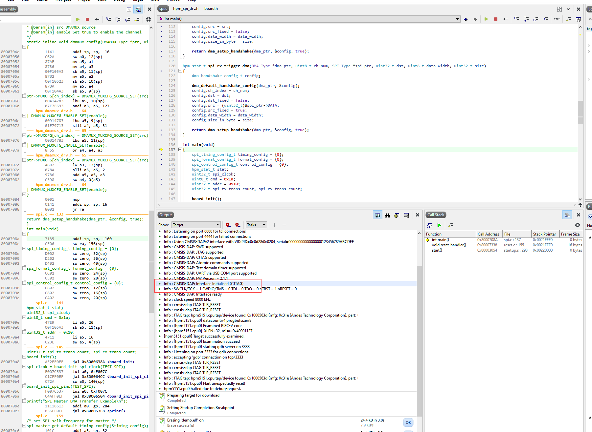

# CherryDAP

CherryDAP is a DAPLink template based on [CherryUSB](https://github.com/sakumisu/CherryUSB) and [ARMmbed DAPLink](https://github.com/ARMmbed/DAPLink).

# Feature

- CMSIS DAP version 2.1, only support winusb
- Support SWD + JTAG + CJTAG
- Support USB2UART
- Support webusb
- Support custom hid

# Projects

- [bl616](projects/bl616/README.md)
- [esp32s3](projects/esp32s3/README.md)
- [HSLink-Lite](projects/HSLink-Lite/README.md)
- [HSLink-Pro](projects/HSLink-Pro/README.md)