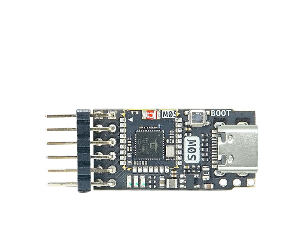
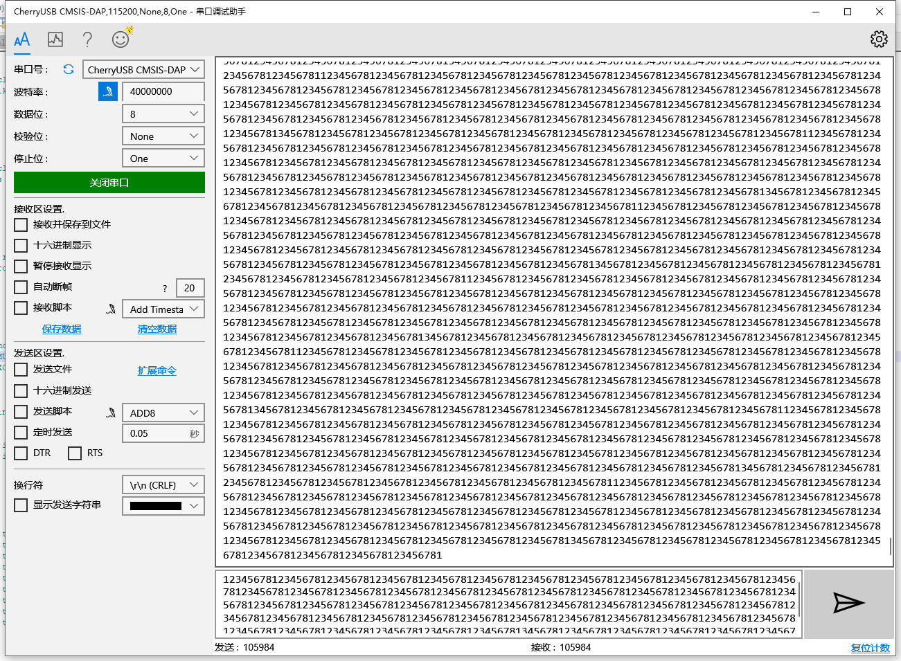

## 支持特性

- USB High speed
- UART with cycle dma(no packet will be lost), so the baudrate can reach 40Mbps

## 硬件连接

| Function | Label | GPIO |
|:--------:|:-----:|:----:|
| JTAG_TCK | IO10 | 10 |
| JTAG_TMS | IO12 | 12 |
| JTAG_TDI | IO14  | 14 |
| JTAG_TDO | IO16  | 16 |
| SWD_SWCLK | IO10 | 10 |
| SWD_SWDIO | IO12 | 12 |
| UART TX | IO11 | 11 |
| UART RX | IO13 | 13 |
| nRESET | - | - |



## 串口测试



## 编译

You can compile with:

```shell
cd projects/bl616

make BL_SDK_BASE=<pwd of bouffalo_sdk prefix>/bouffalo_sdk CROSS_COMPILE=<pwd of toolchain prefix>/toolchain_gcc_t-head_linux/bin/riscv64-unknown-elf-
```
