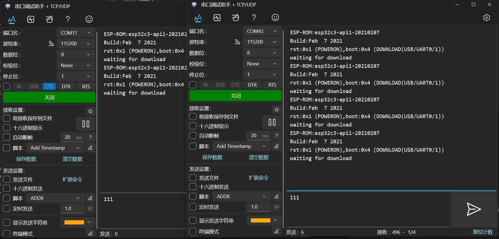

## 硬件连接

| Function | Label | GPIO |
|:--------:|:-----:|:----:|
| SWD_SWCLK | IO17 | 17 |
| SWD_SWDIO | IO16 | 16 |
| JTAG_TCK | IO17 | 17 |
| JTAG_TMS | IO16 | 16 |
| JTAG_TDI | IO15  | 15 |
| JTAG_TDO | IO7  | 7 |
| UART TX | IO11 | 4 |
| UART RX | IO13 | 5 |
| nRESET | IO6 | 6 |

## 串口测试



## 编译

You can compile with:

```shell
cd projects/esp32s3

idf.py build
idf.py -p COM18 flash  # the ch343 usb port, usb cdc port will be init as DAP COM port
idf.py -p COM18 monitor
```

## 编程测试

- [x] ESP32 class
  - [x] ESP32c3/uart
    - [x] esptool/921600
  - [x] ESP32s3/uart
    - [x] esptool/921600
- [x] raspberry
  - [x] rp2040/swd
    - [x] probe-rs/921600
    - [ ] cmsis-dap
    - [ ] picotool
    - [ ] raspberrypi-swd
