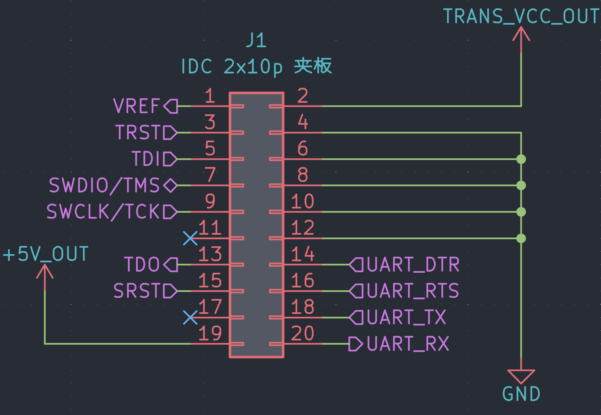

HSLink Pro 是一款使用 HPM5301 芯片的一个 CherryDAP 实现。其中主要代码参考了 [hpm5301evklite](./HPM5301EVKLite) 工程。

## 引脚定义

HSLink Pro 的引脚定义满足 [20-pin J-Link Connector](https://wiki.segger.com/20-pin_J-Link_Connector)定义。目前的引脚定义分配如下：

| 引脚 | 名称 | 描述 |
| --- | --- | --- |
| 1 | Vref | 参考电压输入 |
| 2 | Tvcc | 目标板供电可调电源输出 |
| 3 | TRST | JTAG 复位信号，通常连接到目标 CPU 的 nTRST。该引脚通常在目标上被拉高，以避免在没有连接时意外复位 |
| 4 | GND | 地 |
| 5 | TDI | JTAG TDI |
| 6 | GND | 地 |
| 7 | TMS/SWDIO | 在JTAG模式为TMS，在SWD模式下则为SWDIO |
| 8 | GND | 地 |
| 9 | TCK/SWCLK | 在JTAG模式为TCK，在SWD模式下则为SWCLK |
| 10 | GND | 地 |
| 11 | NC | 未连接 |
| 12 | GND | 地 |
| 13 | TDO | JTAG TDO |
| 14 | UART_DTR | CDC的DTR信号输出，可用于ESP32等MCU串口自动下载 |
| 15 | SRST | 目标板复位信号，低电平有效 |
| 16 | UART_RTS | CDC的RTS信号输出，可用于ESP32等MCU串口自动下载 |
| 17 | NC | 未连接 |
| 18 | UART_TX | 串口TX信号 |
| 19 | GND | 地 |
| 20 | UART_RX | 串口RX信号 |

## 支持特性

目前 HSLink Pro 支持的特性有：

- [x] 提供最高80MHz的 SWD 和 JTAG 速率
- [x] 电平转换功能，适配任意电平的目标板
- [x] 同时支持 SWD 和 JTAG 协议
- [x] 支持为目标板提供最高 1A 负载的供电能力
- [x] 支持虚拟串口功能
- [x] 支持串口的 DTR/RTS 控制，可为 ESP32 等MCU提供自动下载
- [x] 支持SWD模式下对 Arm 芯片进行写`SYSRESETREQ` 和 `VECTRESET` 软复位
- [ ]  支持通过上位机进行持久化配置
- [ ]  支持通过上位机进行固件升级

## 未来特性（画饼）

- [ ] 可通过上位机设置是否开启速度Boost
- [ ] 可通过上位机设置是否开启电平转换
- [ ] 可通过上位机设置是否固定输出电源
- [ ] 可通过上位机设置是否开启软复位
- [ ] 支持更多复位方式，例如POR
- [ ] 上位机支持特化芯片的选项字节配置

## HSLink Pro 升级流程

长按`BL`按钮5秒以上即可进入升级模式，此时电脑上会出现一个`CHERRYUF2`的移动存储设备，将升级的`.uf2`文件拖入其中即可。最新的固件可以在QQ交流群群文件或者[GitHub Actions](https://github.com/cherry-embedded/CherryDAP/actions)的Artifacts中下载。

## FAQ

### 为什么 HSLink Pro 没有电源输出？

当Vref引脚悬空的时候，默认`Tvcc`和`+5V`引脚均不会输出电源，并且所有端口的电平将默认为`3.3V`。只有当`Vref`引脚上施加`1.6V`以上的电压的时候，`Tvcc`才会输出一个与`Vref`相同的电压，`+5V`引脚才会输出`5V`电压。
