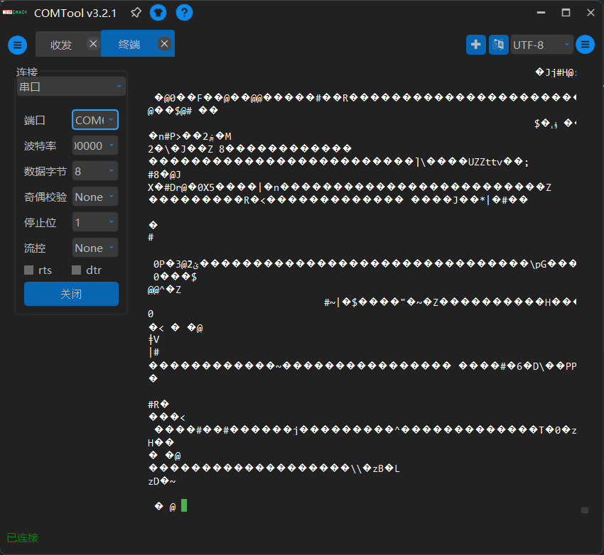
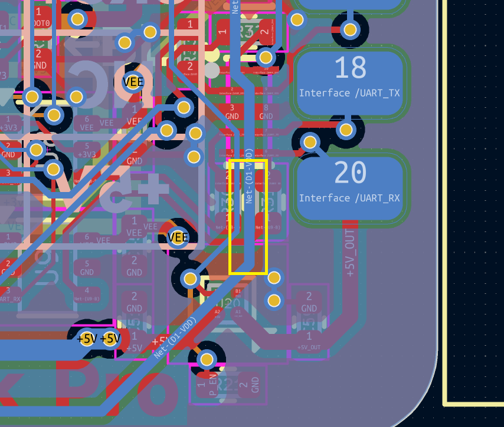
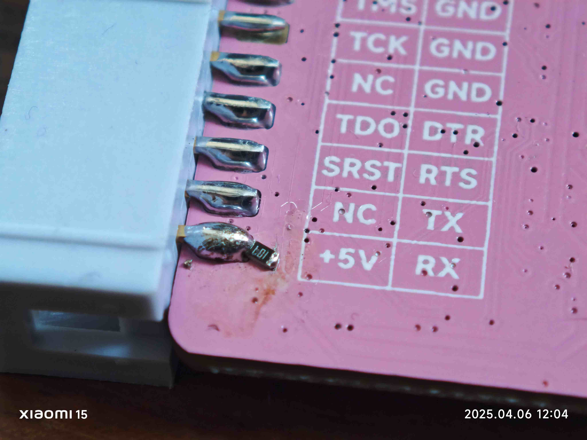

HSLink Pro 是一款使用 HPM5301 芯片的一个 CherryDAP 实现。其中主要代码参考了 [hpm5301evklite](./HPM5301EVKLite) 工程。

## 支持特性

目前 HSLink Pro 支持的特性有：

- [x] 提供最高80MHz的 SWD 和 JTAG 速率
- [x] 电平转换功能，适配任意电平的目标板
- [x] 同时支持 SWD 和 JTAG 协议
- [x] 支持为目标板提供最高 1A 负载的供电能力
- [x] 支持虚拟串口功能
- [x] 支持串口的 DTR/RTS 控制，可为 ESP32 等MCU提供自动下载
- [x] 支持SWD模式下对 Arm 芯片进行写`SYSRESETREQ` 和 `VECTRESET` 软复位
- [x] 支持通过上位机进行持久化配置
- [x] 支持通过上位机进行固件升级
- [x] 可通过上位机设置是否开启速度Boost
- [x] 可通过上位机设置是否开启电平转换
- [x] 可通过上位机设置是否固定输出电源
- [x] 可通过上位机设置是否开启软复位
- [x] 支持更多复位方式，例如POR

上位机下载地址：

<https://github.com/HSLink/HSLinkUpper/releases>

## 引脚定义

HSLink Pro 的引脚定义满足 [20-pin J-Link Connector](https://wiki.segger.com/20-pin_J-Link_Connector)定义。目前的引脚定义分配如下：

| 引脚 | 名称 | 描述 |
| --- | --- | --- |
| 1 | Vref | 参考电压输入 |
| 2 | Tvcc | 目标板供电可调电源输出 |
| 3 | TRST | JTAG 复位信号，通常连接到目标 CPU 的 nTRST。该引脚通常在目标上被拉高，以避免在没有连接时意外复位 |
| 4 | GND | 地 |
| 5 | TDI | JTAG TDI |
| 6 | GND | 地 |
| 7 | TMS/SWDIO | 在JTAG模式为TMS，在SWD模式下则为SWDIO |
| 8 | GND | 地 |
| 9 | TCK/SWCLK | 在JTAG模式为TCK，在SWD模式下则为SWCLK |
| 10 | GND | 地 |
| 11 | NC | 未连接 |
| 12 | GND | 地 |
| 13 | TDO | JTAG TDO |
| 14 | UART_DTR | CDC的DTR信号输出，可用于ESP32等MCU串口自动下载 |
| 15 | SRST | 目标板复位信号，低电平有效 |
| 16 | UART_RTS | CDC的RTS信号输出，可用于ESP32等MCU串口自动下载 |
| 17 | NC | 未连接 |
| 18 | UART_TX | 串口TX信号 |
| 19 | +5V | +5V 电源输出 |
| 20 | UART_RX | 串口RX信号 |

## 上位机配置项

* 速度Boost
  * 启用后实际的速度是Keil中配置的速度（以及其他通过`DAP_SWJ_Clock`接口调用设置的速度）的10倍，上限80M
* SWD/JTAG输出方式
  * SPI模式为使用SPI外设模拟时序
  * GPIO模式为GPIO模拟时序
  * JTAG_SHIFT 加速
    * 该设置项只有当JTAG输出方式设置为SPI时才会生效
    * 选择启用代表将使用SPI外设模拟JTAG的单bit数据（可能会导致一些兼容性问题）
    * 选择禁用代表将使用GPIO模拟JTAG的单bit数据（兼容性较好）

* 参考电压
  * 在Vref没有电压输入或电压小于等于1.6V时，调试器内部Tvcc的电压

* 上电开启电源输出
  * 在Vref没有电压输入或电压小于等于1.6V时，调试器是否输出Tvcc。
  * 在Vref没有电压输入或电压小于等于1.6V时，调试器是否输出+5V（可能随着版本迭代而改变是否受控）

* 上电开启IO输出
  * 在Vref没有电压输入或电压小于等于1.6V时，调试器是否输出信号。

* 默认复位方式
  * 调用`PIN_nRESET_OUT`时的复位行为

* 启用LED，LED亮度
  * 是否启用板载的LED，以及其亮度

## HSLink Pro 升级流程

### 一般升级流程

正常连接电脑，启动完成后长按`BL`按钮2秒以上即可进入升级模式，此时电脑上会出现一个`CHERRYUF2`的移动存储设备，将升级的`.uf2`文件拖入其中即可。最新的固件可以在QQ交流群群文件或者[GitHub releases](https://github.com/cherry-embedded/CherryDAP/releases)中下载。

需要注意的是，如果是在2.3.4及之前版本升级到更新版本，需要先升级`中间包`，再升级其他版本的固件。

### V2.3.4及之前版本升级流程

对于跨越2.4.0的更新，升级到更新版本需要更新Bootloader，必须先更新`中间包`将bootloader升级之后，才能更新到其他更新版本的固件。中间包下载地址: <https://github.com/cherry-embedded/CherryDAP/releases/download/HSLinkPro-2.4.0/HSLink-Pro-Middle.uf2>，其构建的源码为：<https://github.com/HSLink/CherryDAP_HSLink/tree/upgrade-bl-use-app>。

请注意，在这个过程中请**不要断电**！！！

如果一切顺利，HSLink会在LED多次绿色和蓝色闪烁后自动重新出现`CHERRYUF2`移动存储设备，之后再拖入所需要的版本即可更新。

### 回退

一般来说，新Bootloader版本均能启动各版本APP，但新Bootloader可能会导致旧App持久化存储出现问题。旧Bootloader能启动旧版本APP。回滚只需要进入Bootloader将所需固件拖入`CHERRYUF2`即可。

需要注意的是，**我们并未对回滚进行仔细测试**。如果遇到恶性问题，请在QQ群中或是[Issues · cherry-embedded/CherryDAP](https://github.com/cherry-embedded/CherryDAP/issues)处提出，我们将在**master**分支尽快修复。

### 使用上位机升级（需要软件版本大于等于2.4.0）

首先，在设备设置页面连接设备，然后切换到设备升级。对于升级Bootloader，选择固件后升级Bootloader即可。对于升级App，点击进入Bootloader后选择固件后点击升级APP即可。

## FAQ

### 为什么 HSLink Pro 没有电源/信号输出？

如果Vref低于1.6V或悬空，默认并不会输出电源和信号。接入Vref后Tvcc自动生成一个相同的电压输出，信号电平也将调整为相同的电压。也可以通过上位机配置**上电开启电源输出**与**上电开启IO输出**，在Vref低于1.6V时使用配置的电压。

### 读取不到MCU/需要抬高电压才能读到MCU/需要降低速度到很低的水平才能读到MCU

可以尝试将SWD信号线以麻花辫的方式绞成一股。并排杜邦线的形式容易造成奇奇怪怪的干扰。

### JTAG对端短接了TVcc与Vref导致振荡等问题

* 首先，Vref为输入到调试器的参考电平，TVcc为输出的一路跟随Vref的电压，**不应该直接连接**，能修改PCB的话应该修改，或者物理切断线。
* 在对端仅短接，不供电的情况下，电压会产生振荡。请在上位机关闭**上电开启电源输出**。
* 在对端短接并供电时，请确保预设值与Vref值相同以减小双电源供电产生的影响。对于大部分LDO和DCDC，不超出耐受范围，这仍是安全的。对于某些设计了输出大于设定时吸收电流（常见于超高PSRR，90db）的LDO与极少数主动吸收电流的同步整流buck，可能导致一些问题。

### 在下载时串口会有乱码？

很抱歉，这是**HSLink V1.0 V1.2.0 V1.2.1**的硬件缺陷。

对于**HSLink V1.2.0 V1.2.1**，可以尝试刮线飞电阻来解决，使用镊子刮开此线上的阻焊，注意不要刮开旁边一根，使用0402或者0603的100k电阻连接。

请注意，由于此线电压约为5V，请确保**对端IO口耐压5V**!

### 我的HSLink似乎变砖了？

一般情况下正常升级不会出现问题，但是如果出现了问题，可以尝试以下救砖方式：

* 对于开机闪烁2次蓝灯的版本，在闪烁期间按下按钮，即可保持Bootloader，出现`CHERRYUF2`移动存储设备。
* 对于出售的v1.2及之后的版本，Bootloader中已添加看门狗，在多次启动失败后保持在Bootloader的升级状态，即出现`CHERRYUF2`移动存储设备。对于这个版本，尝试连接usb等待30s。
* 如果你有条件使用串口下载，包括但不限于探针、夹子、焊线，推荐使用[hpmicro/hpm_manufacturing_tool: HPMicro Manufacturing Tool](https://github.com/hpmicro/hpm_manufacturing_tool/releases/tag/v0.5.0)下载[GitHub releases](https://github.com/cherry-embedded/CherryDAP/releases)中的**merge.bin**。按住按键插入usb后即可连接isp工具，默认配置即可下载。
* 对于初版也可尝试在插入usb后**立即**按住按钮，出现`CHERRYUF2`移动存储设备即可。由于窗口时间不长，请多次尝试。

## 开源资料

软件：[CherryDAP/projects/HSLink-Pro at master · cherry-embedded/CherryDAP](https://github.com/cherry-embedded/CherryDAP/tree/master/projects/HSLink-Pro)

硬件：[HSLink/HSLink_Hardware: A place to release hslink hardware](https://github.com/HSLink/HSLink_Hardware)

上位机：[HSLink/HSLinkUpper](https://github.com/HSLink/HSLinkUpper)

需求收集：[HSLink需求收集 · Issue #34 · cherry-embedded/CherryDAP](https://github.com/cherry-embedded/CherryDAP/issues/34)

制作指南：[v1.3.1制作指南](https://github.com/HSLink/HSLink_Hardware/blob/main/HSLinkCompact_v1.3.1/ProductionGuide.md)
