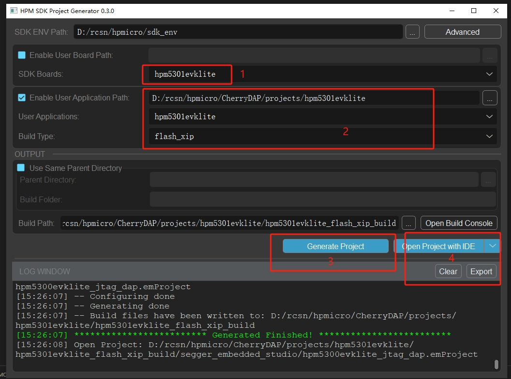
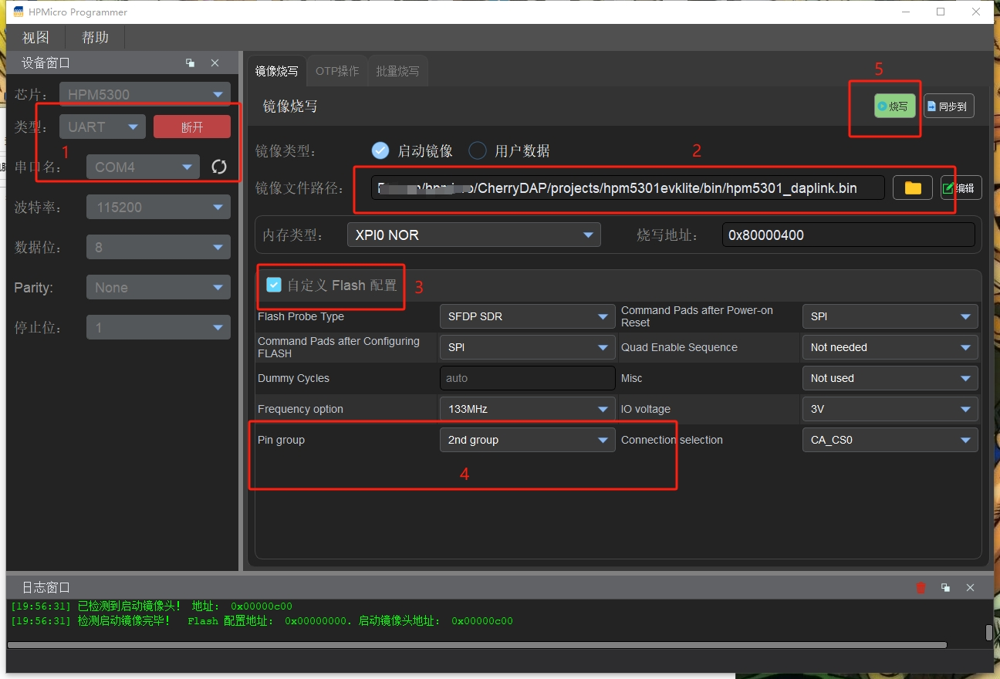

# HPM5301EVKlite

- USB High speed
- Support UART, use DMA(@[**RCSN** ](https://github.com/RCSN))
- The 20PJTAG socket of the J5 interface is used by default.
- support  JTAG (@[**RCSN** ](https://github.com/RCSN))
- support SWD (@[**Aladdin-Wang**](https://github.com/Aladdin-Wang))
- for example, use hpm5301evklite debug hpm5300evk

- Use uart3 as usb2uart

- build

1、 sdk version must be greater than 1.3

2、 download https://github.com/hpmicro/sdk_env

3、 if the sdk is not hpm5300evklite, you can download the pack unzip to sdk_env/hpm_sdk   https://github.com/hpmicro/hpm_sdk/releases/download/v1.3.0/hpm_sdk_v1.3.0_patch-hpm5301evklite.zip

4、open sdk_env start_gui.exe on window

- download firmware

- the firmware bin file path: ../bin/hpm5301_daplink.bin

1、use hpm_manufacturing_tool  https://github.com/hpmicro/hpm_manufacturing_tool

(1) baidu pan: https://pan.baidu.com/s/1RaYHOD7xk7fnotmgLpoAlA?pwd=xk2n
提取码：xk2n 复制这段内容打开「百度网盘APP 即可获取」

(2) unzip, open hpm_manufacturing_gui.exe,

(3) uart0 use usbttl module to connect tool, and press the SW1 and SW2 buttons simultaneously, then release SW1 (RESET), and then release SW2 (boot)

(4) connenct the tool and download firmware

2、use ses ide

3、use gdb